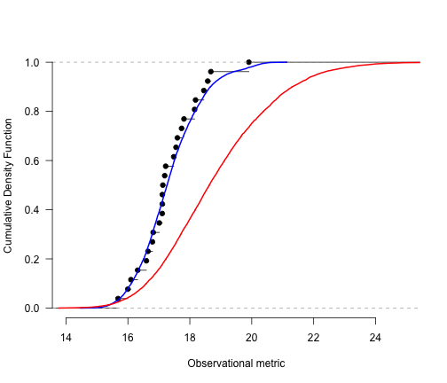
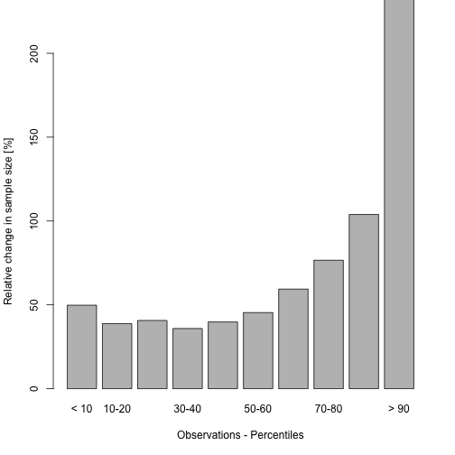
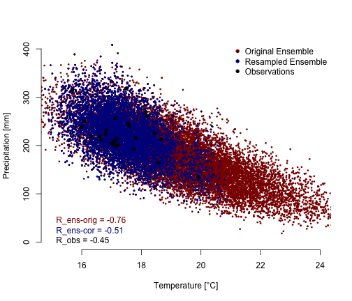

<!-- This is the project specific website template -->
<!-- It can be changed as liked or replaced by other content -->

<html>
<body>

<!-- R-Forge Logo -->


<table border="0" width="100%" cellspacing="0" cellpadding="0">
<tr>
<td>

</td> 
</tr>
</table>

<!-- get project title  -->
<!-- own website starts here, the following may be changed as you like -->

<h1>ensbiascoR: Ensemble Resampling Bias Correction</h1>
<em><p><strong>An R package to resample or constrain large model ensemble to preserve physical aspects of the model simulations.
</strong> </p></em>

<!-- menu -->
<hr>
<h2>Contents</h2>
<ul>
  <li><a href="index.html">ensbiascoR: Introduction and Installation</a></li> 
  <li>ensbiascoR - applications and examples:</li>
	<ul>
		<li><a href="ensbiascoR_example1.html">Example 1: Ensemble resampling bias correction (HadRM3P and weather@home). Monthly temperature and precipitation</a></li>
		<li><a href="ensbiascoR_example2.html">Example 2: Ensemble resampling bias correction (HadRM3P and weather@home). Seasonal maxima of temperature and relative humidity</a></li>
		<li><a href="ensbiascoR_example3.html">Example 3: Land coupling constraints on multi-model ensembles (CMIP5)</a></li>
	</ul>
	<li><a href="http://r-forge.r-project.org/projects/ensbiascor/">Project summary page</a></li>
</ul>
<hr>
<!-- end of menu -->


#### Example 1: Ensemble resampling bias correction (HadRM3P and weather@home). Monthly temperature and precipitation

This example illustrates an ensemble resampling technique for bias correction of large initial condition ensembles. Ensemble simulations from the HadRM3P are bias corrected, a regional variant of HadCM3, and computed through <a href="http://climateprediction.net/weatherathome/"> climateprediction.net/weatherathome</a>. 
The present example is based on the following publication:

Sippel, S., Otto, F. E. L., Forkel, M., Allen, M. R., Guillod, B. P., Heimann, M., Reichstein, M., Seneviratne, S. I., Thonicke, K. & Mahecha, M. D. (2016) A novel bias correction methodology for climate impact simulations. Earth System Dynamics, 7, 71-88. doi:10.5194/esd-7-71-2016.

- Load package and dataset:

```r
library(ensbiascoR)
data(ensbiascoR.example1)
```
- Define an observable meteorological metric as constraint for resampling: Summer (JJA) mean **air temperature** (**Tair**) over Central Europe in the present example 
- Estimate Cumulative Distribution Functions (CDF's) using e.g. a Gaussian kernel with reliable band-width estimation (Sheather and Jones, 
1991) for both modelled and observed data:

```r
kernel.quantiles = seq(0, 1, 0.001)
obs.kernel = get.kernel.percentiles(data=ensbiascoR.example1$obs.data$Tair[which(ensbiascoR.example1$obs.data$Year %in% 1985:2010)], kernel.quantiles = kernel.quantiles)
```

```
## KernSmooth 2.23 loaded
## Copyright M. P. Wand 1997-2009
```

```r
mod.kernel = get.kernel.percentiles(data=ensbiascoR.example1$mod.data$Tair, kernel.quantiles = kernel.quantiles)
```

- Plot CDF of model and observations:

```r
plot(ecdf(ensbiascoR.example1$obs.data$Tair[which(ensbiascoR.example1$obs.data$Year %in% 1985:2010)]), bty='n', 
     xlab = "Observational metric", ylab="Cumulative Density Function", xlim=c(14,25), 
     main="", yaxt="n")
axis(side=2, las=1)
lines(x = obs.kernel, y=kernel.quantiles, col="blue", lwd=2)
lines(x = mod.kernel, y=kernel.quantiles, col="red", lwd = 2)
```

 

- Derive percentile transfer function between CDF's:

```r
cur.transfer.function = get.percentile.transfer.function(obs.grid.cell = ensbiascoR.example1$obs.data$Tair[which(ensbiascoR.example1$obs.data$Year %in% 1985:2010)], mod.grid.cell = ensbiascoR.example1$mod.data$Tair)
```

- PP-plot of transfer function:

```r
plot(x = kernel.quantiles, y = cur.transfer.function(kernel.quantiles), 
     xlab="Observations - CDF", ylab="Model Ensemble - CDF", bty="n",
     xlim = c(0,1), ylim=c(0, 1), type="n")
lines(x = kernel.quantiles, y = cur.transfer.function(kernel.quantiles), col="red")
lines(x=c(-10^6, 10^6), y=c(-10^6,10^6), col="darkgray", lwd = 2)
sapply(X= seq(0, 1, by=0.1), FUN=function(x) lines(x = c(x, x), y = c(0, cur.transfer.function(x)), lty=2, col="black"))
sapply(X= seq(0, 1, by=0.1), FUN=function(x) lines(x = c(0, x), y = c(cur.transfer.function(x), cur.transfer.function(x)), lty = 2, col="black"))
legend("topleft", c("Hermite Splines"), bty='n', lty=1, col="red")
```

 

- Resample the large ensemble:

i. with replacement:

```r
resample.idx_replacement = resample.ensemble(mod.grid.cell = ensbiascoR.example1$mod.data$Tair, transfer.function= cur.transfer.function, replacement = T, sample.size=10000)
```
ii. without replacement:

```r
resample.idx_no_replacement = resample.ensemble(mod.grid.cell = ensbiascoR.example1$mod.data$Tair, transfer.function= cur.transfer.function, replacement = F, sample.size=10000, search.radius = 0.5)
```

- Quantile-quantile plot of resampled ensemble:

```r
plot(c(1,1), type='n', xlim = c(15, 24), ylim= c(15, 24),
     xlab = "Observations", ylab = "Model Ensemble", bty='n')
lines(x=c(1, 100), y=c(1,100), col="darkblue", lwd = 2)
points(x = quantile(obs.kernel, seq(0.01, 0.99, 0.01)), y= quantile(mod.kernel, seq(0.01, 0.99, 0.01)), col="red", pch = 16, cex = 0.8)
points(x = quantile(obs.kernel, seq(0.01, 0.99, 0.01)), y= quantile(ensbiascoR.example1$mod.data$Tair[resample.idx_replacement], seq(0.01, 0.99, 0.01)), col="black", pch = 16, cex = 0.8)
legend("bottomright", c("Original ensemble", "Resampled ensemble"), col=c("red", "black"), bty='n', pch = 16)
```

 

- Quality control of resampled ensemble (i.e. reduction of sample size):

```r
percentile.ranges = seq(0, 1, 0.1)
percentiles.areamean = quality.control.ensemble(transfer.function = cur.transfer.function, percentile.ranges)
text = c("< 10", "10-20",       
         "20-30", "30-40", "40-50", "50-60", "60-70", "70-80", "80-90", "> 90")
ylim = c(0, 2) * 100
barplot(percentiles.areamean, names = text, ylim = ylim,
        xlab = "Observations - Percentiles", ylab = "Relative change in sample size [%]")
```

 

- Investigate changes in resampled ensemble w.r.t. unconstrained metrics:

```r
year.idx = which(ensbiascoR.example1$obs.data$Year %in% 1985:2010)

plot(c(1,1), xlim = c(15,24), ylim=c(0, 400),
     xlab = "Temperature [°C]", ylab = "Precipitation [mm]", bty="n")
points(x=ensbiascoR.example1$mod.data$Tair, y=ensbiascoR.example1$mod.data$Precip, col = "darkred", pch = 16, cex = 0.5)
points(x=ensbiascoR.example1$mod.data$Tair[resample.idx_replacement], y=ensbiascoR.example1$mod.data$Precip[resample.idx_replacement], col = "darkblue", pch=16, cex = 0.5)
points(x = ensbiascoR.example1$obs.data$Tair[year.idx], y = ensbiascoR.example1$obs.data$Precip[year.idx], col = "black", pch = 16, cex = 1)
legend("topright", c("Original Ensemble", "Resampled Ensemble", "Observations"), pch = 16, col=c("darkred", "darkblue", "black"), bty='n')
legend("bottomleft", c(paste("R_ens-orig = ", round(cor(ensbiascoR.example1$mod.data$Tair, ensbiascoR.example1$mod.data$Precip), 2), sep=""),
                       paste("R_ens-cor = ", round(cor(ensbiascoR.example1$mod.data$Tair[resample.idx_replacement], ensbiascoR.example1$mod.data$Precip[resample.idx_replacement]), 2), sep=""),
                       paste("R_obs = ", round(cor(ensbiascoR.example1$obs.data$Tair[year.idx], ensbiascoR.example1$obs.data$Precip[year.idx]), 2), sep="")), text.col=c("darkred", "darkblue", "black"), bty="n")
```

 


