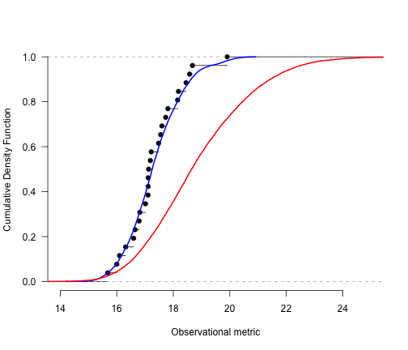
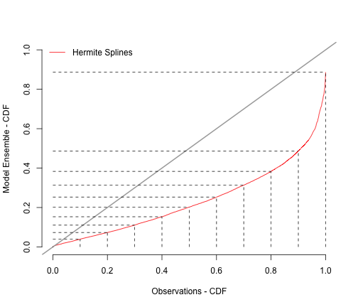
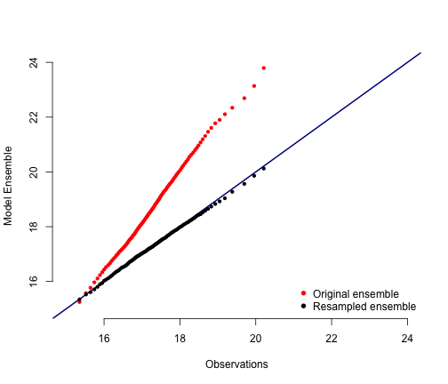
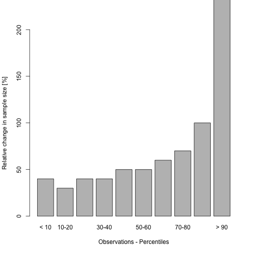

<!-- This is the project specific website template -->
<!-- It can be changed as liked or replaced by other content -->

<html>
<body>

<!-- R-Forge Logo -->


<table border="0" width="100%" cellspacing="0" cellpadding="0">
<tr>
<td>

</td> 
</tr>
</table>

<!-- get project title  -->
<!-- own website starts here, the following may be changed as you like -->

<h1>ensbiascoR: Ensemble Resampling Bias Correction</h1>
<em><p><strong>An R package to resample or constrain large model ensemble to preserve physical aspects of the model simulations.
</strong> </p></em>

<!-- menu -->
<hr>
<h2>Contents</h2>
<ul>
  <li><a href="index.html">ensbiascoR: Introduction and Installation</a></li> 
  <li>ensbiascoR - applications and examples:</li>
	<ul>
		<li><a href="ensbiascoR_example1.html">Example 1: Ensemble resampling bias correction (HadRM3P and weather@home). Monthly temperature and precipitation</a></li>
		<li><a href="ensbiascoR_example2.html">Example 2: Ensemble resampling bias correction (HadRM3P and weather@home). Seasonal maxima of temperature and relative humidity</a></li>
		<li><a href="ensbiascoR_example3.html">Example 3: Land coupling constraints on multi-model ensembles (CMIP5)</a></li>
	</ul>
	<li><a href="http://r-forge.r-project.org/projects/ensbiascor/">Project summary page</a></li>
</ul>
<hr>
<!-- end of menu -->


#### Example 2: Ensemble resampling bias correction (HadRM3P and weather@home). Seasonal maxima of temperature and relative humidity

This example illustrates an ensemble resampling technique for bias correction of large initial condition ensembles and considers specifically **heat-health indicators such as the wet bulb temperature** or similar multivariate indices that combine temperature and relative humidity. Ensemble simulations from the HadRM3P are bias corrected, a regional variant of HadCM3, and computed through <a href="http://climateprediction.net/weatherathome/"> climateprediction.net/weatherathome</a>. The focus here in on seasonal maximum heat stress as indicated e.g. through seasonal maxima of 3-day running averages of daily maximum wet bulb temperature (WBTX_3d), daily maximum Wet Bulb Globe Temperature (WBGTX_3d), or daily maximum temperature (TX_3d).

The present example is based on the following publication:

**will follow soon...**

- Load package and dataset:

```r
library(ensbiascoR)
data(ensbiascoR.example2)
```

- Define an observable meteorological metric as constraint for resampling: Summer (JJA) maximum 21-d running average temperature in three locations (AT-Wien, DE-Jena, NL-DeBilt) 
- Estimate Cumulative Distribution Functions (CDF's) using e.g. a Gaussian kernel with reliable band-width estimation (Sheather and Jones, 
1991) for both modelled and observed data:

```r
location = "DE_JEN" # Define current location
kernel.quantiles = seq(0, 1, 0.001)
obs.kernel = get.kernel.percentiles(data=ensbiascoR.example2[[location]]$obs.data$Tair_21d_seasmax[which(ensbiascoR.example2$DE_JEN$obs.data$Year %in% 1985:2010)], kernel.quantiles = kernel.quantiles)
```

```
## KernSmooth 2.23 loaded
## Copyright M. P. Wand 1997-2009
```

```r
mod.kernel = get.kernel.percentiles(data=ensbiascoR.example2[[location]]$mod.data$Tair_21d_seasmax, kernel.quantiles = kernel.quantiles)
```

- Plot CDF of model and observations:

```r
plot(ecdf(ensbiascoR.example2[[location]]$obs.data$Tair_21d_seasmax[which(ensbiascoR.example2[[location]]$obs.data$Year %in% 1985:2010)]), bty='n', 
     xlab = "Observational metric", ylab="Cumulative Density Function", xlim=c(15,30), 
     main="", yaxt="n")
axis(side=2, las=1)
lines(x = obs.kernel, y=kernel.quantiles, col="blue", lwd=2)
lines(x = mod.kernel, y=kernel.quantiles, col="red", lwd = 2)
legend("topleft", location)
```

 

- Derive percentile transfer function between CDF's:

```r
cur.transfer.function = get.percentile.transfer.function(obs.grid.cell = ensbiascoR.example2[[location]]$obs.data$Tair_21d_seasmax[which(ensbiascoR.example2[[location]]$obs.data$Year %in% 1985:2010)], 
mod.grid.cell = ensbiascoR.example2[[location]]$mod.data$Tair_21d_seasmax)
```

- PP-plot of transfer function:

```r
plot(x = kernel.quantiles, y = cur.transfer.function(kernel.quantiles), 
     xlab="Observations - CDF", ylab="Model Ensemble - CDF", bty="n",
     xlim = c(0,1), ylim=c(0, 1), type="n")
lines(x = kernel.quantiles, y = cur.transfer.function(kernel.quantiles), col="red")
lines(x=c(-10^6, 10^6), y=c(-10^6,10^6), col="darkgray", lwd = 2)
sapply(X= seq(0, 1, by=0.1), FUN=function(x) lines(x = c(x, x), y = c(0, cur.transfer.function(x)), lty=2, col="black"))
sapply(X= seq(0, 1, by=0.1), FUN=function(x) lines(x = c(0, x), y = c(cur.transfer.function(x), cur.transfer.function(x)), lty = 2, col="black"))
legend("topleft", c("Hermite Splines"), bty='n', lty=1, col="red")
```

 

- Resample the large ensemble:

i. with replacement:

```r
resample.idx_replacement = resample.ensemble(mod.grid.cell = ensbiascoR.example2[[location]]$mod.data$Tair_21d_seasmax, transfer.function= cur.transfer.function, replacement = T, sample.size=10000)
```
ii. without replacement:

```r
resample.idx_no_replacement = resample.ensemble(mod.grid.cell = ensbiascoR.example2[[location]]$mod.data$Tair_21d_seasmax, transfer.function= cur.transfer.function, replacement = F, sample.size=1000, search.radius = 0.5)
```

- Look at changes in resampled ensemble w.r.t. unconstrained seasonal maximal of 3-day averages of daily max. Wet Bulb Temperature:

```r
year.idx = which(ensbiascoR.example2[[location]]$obs.data$Year %in% 1985:2010)

plot(c(1,1), type='n', xlim=c(15, 35), ylim=c(15, 28), bty='n',
       xlab = "21-day seas. max. temperature [°C]", ylab = "3-day seas. max. wet bulb temperature [°C]")
points(x= ensbiascoR.example2[[location]]$mod.data$Tair_21d_seasmax, y= ensbiascoR.example2[[location]]$mod.data$WBT_3d_seasmax, 
col="darkred", cex = 0.5, pch = 16)
points(x= ensbiascoR.example2[[location]]$mod.data$Tair_21d_seasmax[resample.idx_replacement], y= ensbiascoR.example2[[location]]$mod.data$WBT_3d_seasmax[resample.idx_replacement], col="darkblue", cex = 0.5, pch = 16)
points(x= ensbiascoR.example2[[location]]$obs.data$Tair_21d_seasmax, ensbiascoR.example2[[location]]$obs.data$WBT_3d_seasmax, col="black", pch=16)
points(x= ensbiascoR.example2[[location]]$obs.data$Tair_21d_seasmax[year.idx], ensbiascoR.example2[[location]]$obs.data$WBT_3d_seasmax[year.idx], col="pink", pch=16)
legend("bottomright", c("ECA&D, 1901-2014", "ECA&D, 1985-2010", "HadRM3P, 1985-2010, original", "HadRM3P, 1985-2010, resampled"), 
col = c("black", "pink", "darkred", "darkblue"), bty='n', pch=16)
legend("topleft", location)
```

 

- Look at changes in resampled ensemble w.r.t. unconstrained seasonal maximal of 3-day averages of Air Temperature:

```r
plot(c(1,1), type='n', xlim=c(15, 35), ylim=c(20, 40), bty='n',
       xlab = "21-day seas. max. temperature [°C]", ylab = "3-day seas. max. temperature [°C]")
points(x= ensbiascoR.example2[[location]]$mod.data$Tair_21d_seasmax, y= ensbiascoR.example2[[location]]$mod.data$Tair_3d_seasmax, 
col="darkred", cex = 0.5, pch = 16)
points(x= ensbiascoR.example2[[location]]$mod.data$Tair_21d_seasmax[resample.idx_replacement], y= ensbiascoR.example2[[location]]$mod.data$Tair_3d_seasmax[resample.idx_replacement], col="darkblue", cex = 0.5, pch = 16)
points(x= ensbiascoR.example2[[location]]$obs.data$Tair_21d_seasmax, ensbiascoR.example2[[location]]$obs.data$Tair_3d_seasmax, col="black", pch=16)
points(x= ensbiascoR.example2[[location]]$obs.data$Tair_21d_seasmax[year.idx], ensbiascoR.example2[[location]]$obs.data$Tair_3d_seasmax[year.idx], col="pink", pch=16)
legend("bottomright", c("ECA&D, 1901-2014", "ECA&D, 1985-2010", "HadRM3P, 1985-2010, original", "HadRM3P, 1985-2010, resampled"), 
col = c("black", "pink", "darkred", "darkblue"), bty='n', pch=16)
legend("topleft", location)
```

 


  
  
  


